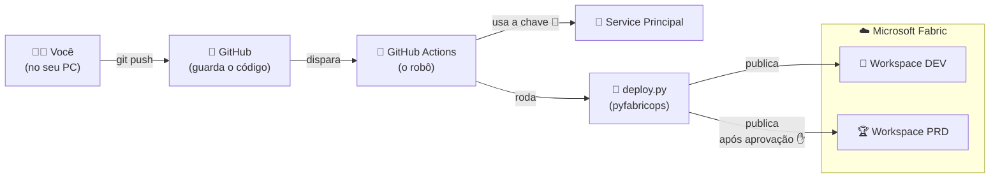
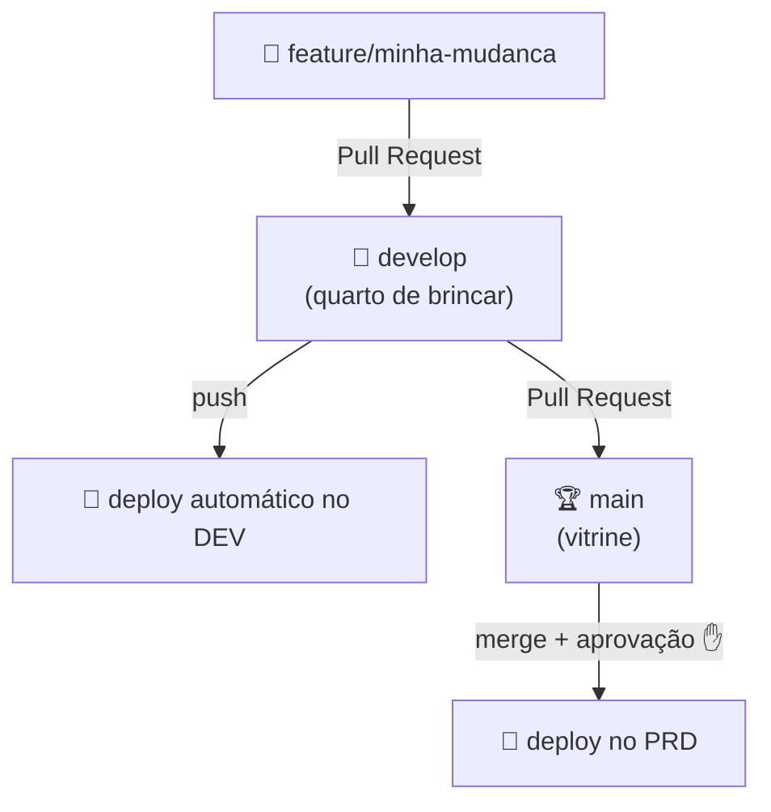
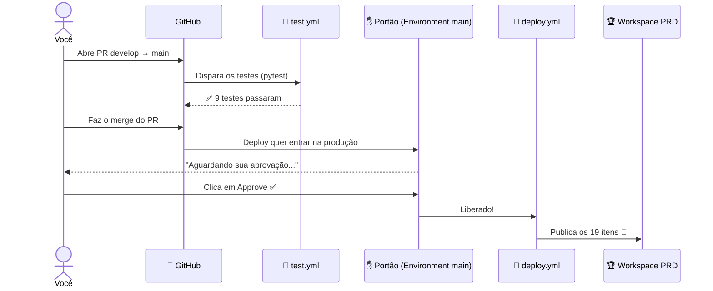

# 🚀 CI/CD no Microsoft Fabric com GitHub Actions

> Workshop prático conduzido por **Sidney** e **Alison** — comunidade Power BI / Fabric

Este repositório mostra, **passo a passo**, como fazer o "robô do GitHub" publicar
sozinho os seus relatórios, notebooks e modelos do **Microsoft Fabric** — sem você
precisar clicar em nada manualmente.

> 📦 A versão antiga deste projeto (que rodava no **Azure DevOps**) ficou guardada na
> pasta [`projeto_com_azure_devops/`](projeto_com_azure_devops) só como recordação. Tudo
> hoje roda no **GitHub Actions**.

---

## 🧒 Explicando como para uma criança de 10 anos

Imagine que você tem dois quartos de brinquedos:

- 🧸 **DEV** = o quarto de **brincar e bagunçar** (workspace `Workshop_DMF-DEV`)
- 🏆 **PRD** = a **vitrine arrumada** que as visitas veem (workspace `Workshop_DMF-PRD`)

Você **brinca e testa** no quarto de bagunça. Quando o brinquedo fica pronto e bonito,
um **robô** (o GitHub Actions) pega ele e coloca na vitrine — **mas só depois que um
adulto disser "pode pôr na vitrine!"** (a aprovação de produção).

O robô precisa de 3 coisas para trabalhar:

| O que o robô precisa | No projeto chamamos de |
|---|---|
| 🔑 Uma **chave** para entrar nos quartos | Service Principal + Secrets |
| 📒 Um **caderninho** dizendo qual quarto é qual | `variables.json` e `valueSets/` |
| 🏷️ Uma **etiqueta** em cada brinquedo dizendo o que ele é | arquivos `.platform` |

Se qualquer uma das 3 estiver errada, o robô trava. Foi exatamente isso que aconteceu
com a gente — e está tudo explicado lá embaixo em **[Problemas que encontramos](#-problemas-que-encontramos-e-como-resolver)**.

---

## 🗺️ Como as peças se encaixam



---

## 📋 Pré-requisitos (o que você precisa antes de começar)

| Você precisa de... | Para quê? |
|---|---|
| Conta no **GitHub** | Guardar o código e rodar o robô |
| **Microsoft Fabric** com 2 workspaces (DEV e PRD) | Os "quartos" onde os itens são publicados |
| Um **Service Principal** (App Registration no Entra ID) | A "chave robô" que publica sem ser uma pessoa |
| **Git** instalado no PC | Para clonar e enviar mudanças |
| **Python 3.13+** e **uv** (opcional, só para rodar local) | Testar antes de enviar |

---

## 🚀 Passo a passo: do clone ao primeiro deploy

> Siga na ordem. Cada passo resolve um dos problemas que a gente encontrou de verdade.

### 1️⃣ Clonar o projeto

```bash
git clone https://github.com/<sua-conta>/<seu-repo>.git
cd <seu-repo>
```

> 📁 Repare que o projeto Fabric fica dentro da pasta `Workshop_DMF/`. A pasta `.github/`
> (com o robô) fica na **raiz**, um nível acima. Isso é importante!

### 2️⃣ Criar o Service Principal (a "chave robô")

No portal do **Azure / Entra ID**:

1. **App registrations → New registration** → dê um nome (ex: `sp-fabric-cicd`)
2. Anote 3 valores:
   - **Directory (tenant) ID** → vira o secret `FAB_TENANT_ID`
   - **Application (client) ID** → vira o secret `FAB_CLIENT_ID`
   - Em **Certificates & secrets → New client secret** → vira `FAB_CLIENT_SECRET`

> ⚠️ O secret só aparece **uma vez**. Copie na hora!

### 3️⃣ Dar acesso do robô aos workspaces

Esse passo foi onde tomamos o primeiro erro (`403 InsufficientPrivileges`).

Em **cada workspace** (DEV e PRD) no Fabric:

1. Abra **Manage access** (Gerenciar acesso)
2. **Add people or groups** → procure pelo nome do Service Principal
3. Dê a função **Admin** (ou no mínimo **Contributor**)

> 🤖 Sem isso, o robô tem a chave mas a porta continua trancada.

### 4️⃣ Configurar os Secrets no GitHub

No GitHub: **Settings → Secrets and variables → Actions** (ou dentro de cada Environment).

Crie os 3 secrets — **só os nomes, os valores ficam escondidos**:

```
FAB_TENANT_ID
FAB_CLIENT_ID
FAB_CLIENT_SECRET
```

> 🔒 **Nunca** escreva esses valores dentro de arquivos do projeto! Use sempre Secrets.
> O arquivo `.env` local existe só para testes na sua máquina e está no `.gitignore`.

### 5️⃣ Criar os Environments (develop e main)

No GitHub: **Settings → Environments**.

1. Crie um Environment chamado **`develop`** (o quarto de brincar — sem trava)
2. Crie um Environment chamado **`main`** (a vitrine — **com trava**):
   - Marque **Required reviewers** e adicione você mesmo
   - Isso cria o **portão de aprovação** antes do deploy em produção

> ✋ É esse "Required reviewers" que faz o robô **parar e esperar** sua autorização
> antes de mexer na produção.

### 6️⃣ Conferir os IDs dos workspaces (o "caderninho")

Esse foi o nosso segundo erro: os IDs estavam desatualizados e o robô tentava entrar
no quarto errado.

Abra estes arquivos e confira se os IDs são os **reais** dos seus workspaces:

| Arquivo | Para qual ambiente |
|---|---|
| `Workshop_DMF/src/CICD/EnvironmentVariables.VariableLibrary/variables.json` | DEV (padrão) |
| `Workshop_DMF/src/CICD/EnvironmentVariables.VariableLibrary/valueSets/main.json` | PRD (sobrescreve quando a branch é `main`) |

O `workspace_id` precisa bater com o ID real. Como descobrir o ID? Está na URL do
workspace no Fabric, ou rode o teste de conexão do passo 8.

> 💡 Dica: o ID do workspace aparece **várias vezes** no arquivo (no `workspace_id` e
> dentro de cada lakehouse/notebook). Troque **todas** as ocorrências.

### 7️⃣ Garantir os arquivos `.platform` (a "etiqueta")

Esse foi o terceiro erro: o `pyfabricops` precisa de um arquivo `.platform` dentro de
**cada** item, dizendo o **tipo** (Notebook, Lakehouse, Report...) e o **nome**.

Verifique se cada pasta de item tem um `.platform`:

```bash
find Workshop_DMF/src -name ".platform"
```

Se algum estiver faltando, crie no formato:

```json
{
  "$schema": "https://developer.microsoft.com/json-schemas/fabric/platform/0.0.1/schema.json",
  "metadata": {
    "type": "Notebook",
    "displayName": "load_bronze"
  },
  "config": {
    "version": "2.0",
    "logicalId": "<um-uuid-qualquer>"
  }
}
```

> 🏷️ Sem a etiqueta, o robô vê o brinquedo mas não sabe o que é — e desiste.

### 8️⃣ Primeiro deploy 🎉

Teste a chave **localmente antes** (opcional, mas recomendado):

```bash
cd Workshop_DMF
python -c "import pyfabricops as pf; pf.set_auth_provider('env'); print(pf.get_workspace('<SEU_WORKSPACE_ID_DEV>', df=False))"
```

Se aparecer o nome do workspace, a chave funciona! Agora é só enviar para o GitHub:

```bash
git add .
git commit -m "feat: configura CI/CD"
git push origin develop
```

O robô acorda sozinho e publica no DEV. Veja em **Actions** no GitHub.

---

## 🔄 O fluxo do dia a dia (Git + PR + aprovação)

### Como as branches conversam



### O caminho completo até a produção (com o portão de aprovação)



### Resumo bem curtinho

```
feature ──PR──► develop ──(deploy automático no DEV)
                   │
                   └──PR──► main
                              │
                        🧪 test.yml (pytest) ✓
                              │
                        ✋ portão espera você aprovar
                              │
                        ✅ você aprova ──► 🤖 deploy no PRD
```

> A **única** coisa manual em produção é clicar em **Approve**. Todo o resto é automático.

---

## 🧪 Como testar

Os testes são "provas estáticas" — leem os arquivos sem se conectar ao Fabric. Rápido e seguro.

```bash
cd Workshop_DMF
uv sync --group dev --no-install-project
uv run pytest tests/ -v
```

O que eles checam:
- **Relatório**: tem `report.json`, todo visual tem `$schema` e `visualType`, e as medidas
  usadas existem no modelo
- **Modelo semântico**: toda medida tem descrição `///`, `displayFolder` e `lineageTag`;
  tabelas com acento (Logística, Calendário) estão entre aspas

No GitHub, esses testes rodam **sozinhos** em todo PR para a `main` (workflow `test.yml`).

---

## 🐞 Problemas que encontramos (e como resolver)

Esta é a parte mais valiosa para **replicar em outros projetos**. Foram os 4 obstáculos reais:

### ❌ Erro 1: `403 InsufficientPrivileges`
**Sintoma:** o deploy autentica mas leva 403 ao acessar o workspace.
**Causa:** o Service Principal não era membro do workspace.
**Solução:** adicionar o SP como **Admin/Contributor** em cada workspace (Passo 3).

### ❌ Erro 2: `403` mesmo com o SP no workspace / workspace errado
**Sintoma:** 403 ou `AttributeError: 'NoneType' object has no attribute 'get'`.
**Causa:** o `workspace_id` no `variables.json` / `main.json` estava **desatualizado**.
**Solução:** trocar **todas** as ocorrências do ID pelo ID real do workspace (Passo 6).

### ❌ Erro 3: `No items to deploy` (mesmo tendo mudado arquivos)
**Sintoma:** o deploy roda mas não acha nada para publicar.
**Causa:** o workflow roda em `working-directory: Workshop_DMF`, mas `git diff` devolvia
caminhos a partir da raiz do repo (`Workshop_DMF/src/...`), e o script esperava `src/...`.
**Solução:** adicionamos a flag `--relative` no `git diff` dentro de `scripts/utils.py`.

```python
# scripts/utils.py
out = _run(["git", "diff", "--name-only", "--relative", base_ref, head_ref])
```

### ❌ Erro 4: `FileNotFoundError: ...\.platform`
**Sintoma:** o item é detectado, mas o deploy quebra ao tentar ler o `.platform`.
**Causa:** o repositório não tinha os arquivos `.platform` (formato exigido pelo pyfabricops).
**Solução:** criamos um `.platform` para **cada** item com `type` e `displayName` corretos (Passo 7).

> 🧠 **Lição geral:** chave (3) → caderninho (6) → etiqueta (7). Resolva nessa ordem.

---

## 📁 Estrutura do projeto

```
.
├── .github/workflows/
│   ├── deploy.yml          # 🤖 publica no Fabric (push em develop/main + manual)
│   └── test.yml            # 🧪 roda pytest em PR para main
├── projeto_com_azure_devops/   # 📦 versão antiga (Azure DevOps) — só referência
└── Workshop_DMF/
    ├── scripts/
    │   ├── deploy.py        # orquestra o deploy (detecta itens, troca IDs, publica)
    │   └── utils.py         # detecção de itens alterados via git diff
    ├── src/                 # 🧱 os artefatos do Fabric
    │   ├── CICD/EnvironmentVariables.VariableLibrary/   # o "caderninho" de IDs
    │   ├── Lakehouses/      # bronze / silver / gold
    │   ├── Notebooks/       # notebooks de ETL
    │   ├── Pipelines/       # data pipelines
    │   ├── Reports/         # relatórios Power BI
    │   └── Semantic Models/ # modelos semânticos (TMDL)
    └── tests/               # provas estáticas (pytest)
```

---

## ⚙️ Como o `deploy.yml` funciona (modos de deploy)

O workflow pode ser disparado **automaticamente** (push) ou **manualmente**
(Actions → Deploy → Run workflow), com 3 modos:

| Modo | O que faz | Quando usar |
|---|---|---|
| `selective` (padrão) | Publica só o que **mudou** (via `git diff`) | Dia a dia |
| `specific` | Publica uma **lista** que você digita | Republicar um item específico |
| `full` | Publica **todos** os itens de `src/` | Primeira carga / recuperação |

> O ambiente (`develop` ou `main`) é escolhido automaticamente pela branch, e os IDs
> de produção vêm do `valueSets/main.json`.

---

## 🛡️ Boas práticas (resumo)

```
✅ Service Principal (não usuário pessoal) para automação
✅ Secrets no GitHub / Key Vault — nunca dentro de arquivos
✅ Sempre usar IDs (não nomes) para referenciar artefatos
✅ Produção sempre atrás de um portão de aprovação
✅ Todo merge para develop/main passa por Pull Request

❌ Nunca conectar produção à branch de desenvolvimento
❌ Nunca commitar .env ou client secrets
```

---

## 📚 Referências

- 📖 [Documentação Microsoft Fabric](https://learn.microsoft.com/fabric)
- 🐍 [PyFabricOps](https://pypi.org/project/pyfabricops/) — biblioteca usada no deploy
- 🤖 [GitHub Actions](https://docs.github.com/actions)
- 🔐 [GitHub Environments e aprovações](https://docs.github.com/actions/deployment/targeting-different-environments/using-environments-for-deployment)

---

<div align="center">

**Workshop CI/CD no Microsoft Fabric**
Conduzido por Sidney e Alison — Comunidade Power BI Brasil

</div>
