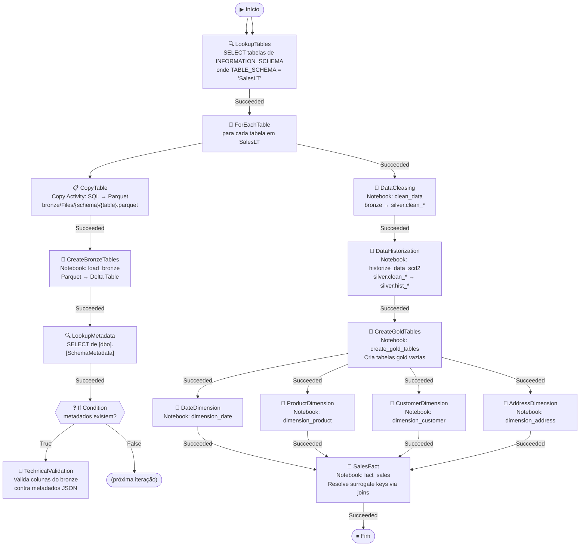

# 🔗 Linhagem de Dados — Workshop_DMF-DEV

> Rastreia a origem, transformações e destino de cada conjunto de dados na solução.

---

## 📋 Sumário

1. [Visão Geral da Linhagem](#visão-geral-da-linhagem)
2. [Diagrama Mermaid — Linhagem Completa](#diagrama-mermaid--linhagem-completa)
3. [Diagrama Mermaid — Pipeline de Orquestração](#diagrama-mermaid--pipeline-de-orquestração)
4. [Linhagem por Tabela Gold](#linhagem-por-tabela-gold)
5. [Dependências entre Notebooks](#dependências-entre-notebooks)

---

## 🗺️ Visão Geral da Linhagem

```
FONTE EXTERNA                    BRONZE                       SILVER                        GOLD
──────────────                   ──────                       ──────                        ────
Azure SQL DB                     Lakehouse bronze             Lakehouse silver              Lakehouse gold
AdventureWorks                   schema: adventureworks       schema: adventureworks        schema: adventureworks
schema: SalesLT
                                                                                            ┌─────────────────────┐
address          ──────────────► address          ──clean──► clean_address   ──scd2──►     │  dimension_address  │
customer         ──────────────► customer         ──clean──► clean_customer  ──scd2──►     │  dimension_customer │
customeraddress  ──────────────► customeraddress  ──clean──► clean_customer  ──scd2──►     │  (via customeraddr) │
product          ──────────────► product          ──clean──► clean_product   ──scd2──►     │  dimension_product  │
productcategory  ──────────────► productcategory  ──clean──► clean_product   ──scd2──►     │  (join category)    │
productmodel     ──────────────► productmodel     ──clean──► clean_product   ──scd2──►     │  (join model)       │
productdescr..   ──────────────► productdescr..   ──clean──► clean_product   ──scd2──►     │  dimension_date     │
salesorderheader ──────────────► salesorderheader ──clean──► clean_saleshead ──scd2──►     │  (from orderheader) │
salesorderdetail ──────────────► salesorderdetail ──clean──► clean_salesdet  ──scd2──►     │  fact_sales         │
productmodelp.d. ──────────────► productmodelp.d. ──clean──► clean_productm  ──scd2──►     └─────────────────────┘
                                                                                                        │
                                                                                                        ▼
                                                                                           ┌─────────────────────┐
                                                                                           │  Semantic Model     │
                                                                                           │  Sales (DirectLake) │
                                                                                           └──────────┬──────────┘
                                                                                                      │
                                                                                                      ▼
                                                                                           ┌──────────────────────┐
                                                                                           │   Sales Report       │
                                                                                           │   (Power BI)         │
                                                                                           └──────────────────────┘
```

---

## 📊 Diagrama Mermaid — Linhagem Completa

```mermaid
flowchart TD
    subgraph SRC ["☁️ Fonte — Azure SQL Database (AdventureWorks / SalesLT)"]
        direction TB
        SQL_address["address"]
        SQL_customer["customer"]
        SQL_customeraddress["customeraddress"]
        SQL_product["product"]
        SQL_productcategory["productcategory"]
        SQL_productmodel["productmodel"]
        SQL_productdescription["productdescription"]
        SQL_productmodelpd["productmodelproductdescription"]
        SQL_salesorderheader["salesorderheader"]
        SQL_salesorderdetail["salesorderdetail"]
    end

    subgraph BRONZE ["🥉 Bronze Lakehouse — adventureworks.*"]
        direction TB
        B_address["address"]
        B_customer["customer"]
        B_customeraddress["customeraddress"]
        B_product["product"]
        B_productcategory["productcategory"]
        B_productmodel["productmodel"]
        B_productdescription["productdescription"]
        B_productmodelpd["productmodelproductdescription"]
        B_salesorderheader["salesorderheader"]
        B_salesorderdetail["salesorderdetail"]
    end

    subgraph SILVER_CLEAN ["🥈 Silver — clean_*"]
        direction TB
        S_clean_address["clean_address"]
        S_clean_customer["clean_customer"]
        S_clean_customeraddress["clean_customeraddress"]
        S_clean_product["clean_product"]
        S_clean_productcategory["clean_productcategory"]
        S_clean_productmodel["clean_productmodel"]
        S_clean_productdescription["clean_productdescription"]
        S_clean_productmodelpd["clean_productmodelproductdescription"]
        S_clean_salesorderheader["clean_salesorderheader"]
        S_clean_salesorderdetail["clean_salesorderdetail"]
    end

    subgraph SILVER_HIST ["🥈 Silver — hist_* (SCD2)"]
        direction TB
        S_hist_address["hist_address"]
        S_hist_customer["hist_customer"]
        S_hist_customeraddress["hist_customeraddress"]
        S_hist_product["hist_product"]
        S_hist_productcategory["hist_productcategory"]
        S_hist_productmodel["hist_productmodel"]
        S_hist_productdescription["hist_productdescription"]
        S_hist_productmodelpd["hist_productmodelproductdescription"]
        S_hist_salesorderheader["hist_salesorderheader"]
        S_hist_salesorderdetail["hist_salesorderdetail"]
    end

    subgraph GOLD ["🥇 Gold Lakehouse — adventureworks.* (Star Schema)"]
        direction TB
        G_dim_address["dimension_address"]
        G_dim_customer["dimension_customer"]
        G_dim_date["dimension_date"]
        G_dim_product["dimension_product"]
        G_fact_sales["fact_sales"]
    end

    subgraph ANALYTICS ["📊 Analytics Layer"]
        SM["Semantic Model: Sales\n(DirectLake)"]
        RPT["Report: Sales Report"]
    end

    SRC --> |Pipeline: CopyTable + load_bronze| BRONZE
    BRONZE --> |Notebook: clean_data| SILVER_CLEAN
    SILVER_CLEAN --> |Notebook: historize_data_scd2| SILVER_HIST

    S_hist_address --> |dimension_address| G_dim_address
    S_hist_customer --> |dimension_customer| G_dim_customer
    S_hist_salesorderheader --> |dimension_date| G_dim_date
    S_hist_product --> |dimension_product| G_dim_product
    S_hist_productcategory --> |dimension_product join| G_dim_product
    S_hist_productmodel --> |dimension_product join| G_dim_product
    S_hist_salesorderdetail --> |fact_sales| G_fact_sales
    S_hist_salesorderheader --> |fact_sales| G_fact_sales

    G_dim_address --> |surrogate key join| G_fact_sales
    G_dim_customer --> |surrogate key join| G_fact_sales
    G_dim_product --> |surrogate key join| G_fact_sales
    G_dim_date --> |surrogate key join| G_fact_sales

    GOLD --> SM
    SM --> RPT
```



---

## 🔄 Diagrama Mermaid — Pipeline de Orquestração



---

## 🗂️ Linhagem por Tabela Gold

### `gold.adventureworks.dimension_address`
| Origem | Transformação | Destino |
|---|---|---|
| `silver.adventureworks.hist_address` | Filtro `current=True`, dedup por `AddressID`, seleção de colunas, SHA-256 como ID | `gold.adventureworks.dimension_address` |

**Colunas da linhagem**: `AddressID, AddressLine1, AddressLine2, City, StateProvince, CountryRegion` → + `ID` (hash)

---

### `gold.adventureworks.dimension_customer`
| Origem | Transformação | Destino |
|---|---|---|
| `silver.adventureworks.hist_customer` | Filtro `current=True`, dedup por `CustomerID`, seleção de colunas, SHA-256 como ID | `gold.adventureworks.dimension_customer` |

**Colunas da linhagem**: `CustomerID, Title, FirstName, MiddleName, LastName, CompanyName, EmailAddress, Phone` → + `ID` (hash)

---

### `gold.adventureworks.dimension_date`
| Origem | Transformação | Destino |
|---|---|---|
| `silver.adventureworks.hist_salesorderheader` | Filtro `current=True`, dedup por `OrderDate`, extração de `Day/Month/Year`, SHA-256 como ID | `gold.adventureworks.dimension_date` |

---

### `gold.adventureworks.dimension_product`
| Origem | Transformação | Destino |
|---|---|---|
| `silver.adventureworks.hist_product` | Filtro `current=True`, dedup por `ProductID` | `gold.adventureworks.dimension_product` |
| `silver.adventureworks.hist_productcategory` | Join por `ProductCategoryID` | ↑ (enriquece com CategoryName) |
| `silver.adventureworks.hist_productmodel` | Join por `ProductModelID` | ↑ (enriquece com ProductModelName) |

---

### `gold.adventureworks.fact_sales`
| Origem | Transformação | Destino |
|---|---|---|
| `silver.adventureworks.hist_salesorderdetail` | Dedup por `SalesOrderID`, cálculo `Revenue = OrderQty * UnitPrice` | `gold.adventureworks.fact_sales` |
| `silver.adventureworks.hist_salesorderheader` | Join para trazer `CustomerID, BillToAddressID, OrderDate` | ↑ |
| `gold.adventureworks.dimension_address` | Join por `BillToAddressID = AddressID` → resolve `AddressKey` | ↑ |
| `gold.adventureworks.dimension_customer` | Join por `CustomerID` → resolve `CustomerKey` | ↑ |
| `gold.adventureworks.dimension_product` | Join por `ProductID` → resolve `ProductKey` | ↑ |
| `gold.adventureworks.dimension_date` | Join por `OrderDate` → resolve `DateKey` | ↑ |

---

## 🔀 Dependências entre Notebooks (execução no pipeline)

```
load_bronze  ──────────────────────────────────┐
TechnicalValidation (condicional)              │ ForEach por tabela
                                               │
clean_data         ←── depende de: ForEach ───┘
historize_data_scd2 ←── depende de: clean_data
create_gold_tables  ←── depende de: historize_data_scd2
                                               ┌────────────────────┐
dimension_address   ←── depende de: create_gold │                    │
dimension_customer  ←── depende de: create_gold │  (execução em     │
dimension_date      ←── depende de: create_gold │   paralelo)       │
dimension_product   ←── depende de: create_gold │                    │
                                               └────────────────────┘
fact_sales ←── depende de: TODOS os 4 notebooks de dimensão
```
