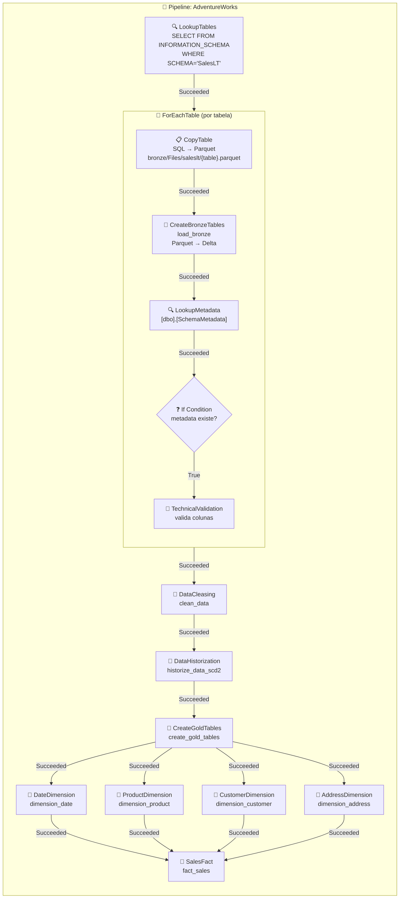

# 🔗 Análise do Pipeline — Workshop_DMF-DEV

> Análise detalhada do pipeline de orquestração: atividades, dependências e configurações.

---

## 📋 Sumário

1. [Pipeline: AdventureWorks](#pipeline-adventureworks)
2. [Atividades de Nível Superior](#atividades-de-nível-superior)
3. [Atividades Internas (ForEach)](#atividades-internas-foreach)
4. [Configuração de Dependências](#configuração-de-dependências)
5. [Fluxo Visual](#fluxo-visual)
6. [Parâmetros e Configurações](#parâmetros-e-configurações)

---

## Pipeline: AdventureWorks

| Atributo | Detalhe |
|---|---|
| **ID** | `a274d88f-4be9-4dc0-83c8-a08d265d1235` |
| **Tipo** | DataPipeline (Fabric Data Factory) |
| **Fonte** | Azure SQL Database (AdventureWorks, schema `SalesLT`) |
| **Destino** | Bronze → Silver → Gold lakehouses |
| **Total de atividades** | 10 no nível principal + 4 dentro do ForEach |
| **Configuração** | Usa `libraryVariables` da VariableLibrary `EnvironmentVariables` |

---

## 🏗️ Atividades de Nível Superior

| # | Nome | Tipo | Descrição |
|---|---|---|---|
| 1 | **LookupTables** | Lookup | Consulta `INFORMATION_SCHEMA.TABLES` no Azure SQL (schema `SalesLT`, `TABLE_TYPE='BASE TABLE'`). Retorna lista de todas as tabelas |
| 2 | **ForEachTable** | ForEach | Itera sobre cada tabela retornada pelo LookupTables e executa atividades de ingestão bronze |
| 3 | **DataCleasing** | TridentNotebook | Executa notebook `clean_data` — limpeza e transformação no silver |
| 4 | **DataHistorization** | TridentNotebook | Executa notebook `historize_data_scd2` — aplicação de SCD2 no silver |
| 5 | **CreateGoldTables** | TridentNotebook | Executa notebook `create_gold_tables` — criação das tabelas gold |
| 6 | **DateDimension** | TridentNotebook | Executa notebook `dimension_date` — constrói dimensão de datas |
| 7 | **ProductDimension** | TridentNotebook | Executa notebook `dimension_product` — constrói dimensão de produtos |
| 8 | **CustomerDimension** | TridentNotebook | Executa notebook `dimension_customer` — constrói dimensão de clientes |
| 9 | **AddressDimension** | TridentNotebook | Executa notebook `dimension_address` — constrói dimensão de endereços |
| 10 | **SalesFact** | TridentNotebook | Executa notebook `fact_sales` — constrói tabela fato de vendas |

---

## 🔁 Atividades Internas (ForEach)

O **ForEachTable** itera sobre cada tabela do schema `SalesLT` e executa as seguintes atividades para cada uma:

| # | Nome | Tipo | Descrição |
|---|---|---|---|
| 1 | **CopyTable** | Copy | Copia a tabela do Azure SQL para Parquet no bronze lakehouse |
| 2 | **CreateBronzeTables** | TridentNotebook | Executa `load_bronze` — carrega parquet como delta table no bronze |
| 3 | **LookupMetadata** | Lookup | Consulta `[dbo].[SchemaMetadata]` no Azure SQL para obter metadados da tabela |
| 4 | **If Condition** | IfCondition | Se metadados existirem → executa `TechnicalValidation` |

### Detalhe: CopyTable
- **Fonte**: Azure SQL (tabela dinâmica: `@item().table_schema.@item().table_name`)
- **Destino**: Bronze lakehouse Files
  - Path: `bronze/Files/{table_schema}/{table_name}.parquet`
- **Formato destino**: Parquet
- **Configuração**: Usa connection da VariableLibrary (`@pipeline().libraryVariables.EnvironmentVariables_connection`)
- **Timeout**: 12 horas, sem retry

### Detalhe: CreateBronzeTables (load_bronze)
Passa parâmetros dinâmicos ao notebook `load_bronze`:
- `schemaName` = `@item().table_schema` (ex: `saleslt` ou `adventureworks`)
- `tableName` = `@item().table_name`
- `filePath` = caminho relativo do parquet

### Detalhe: LookupMetadata
- Consulta `[dbo].[SchemaMetadata]` no Azure SQL filtrando pela tabela atual
- Retorna lista de metadados de colunas esperadas (usado na validação técnica)
- `firstRowOnly: false` (retorna todas as linhas de metadados)

### Detalhe: If Condition
- **Condição**: verifica se o resultado do LookupMetadata não é vazio
- **Se verdadeiro**: executa `TechnicalValidation` notebook, passando:
  - `schemaName`, `tableName`
  - `metadata` = output do LookupMetadata como JSON string

---

## 🔀 Configuração de Dependências

### Nível Principal (dependências entre atividades)

```
LookupTables
    └─[Succeeded]─► ForEachTable
                        └─[Succeeded]─► DataCleasing
                                            └─[Succeeded]─► DataHistorization
                                                                └─[Succeeded]─► CreateGoldTables
                                                                                    ├─[Succeeded]─► DateDimension ───┐
                                                                                    ├─[Succeeded]─► ProductDimension ┤
                                                                                    ├─[Succeeded]─► CustomerDimension┤──► SalesFact
                                                                                    └─[Succeeded]─► AddressDimension ┘
```

### Dentro do ForEach (dependências internas)

```
CopyTable
    └─[Succeeded]─► CreateBronzeTables (load_bronze)
                        └─[Succeeded]─► LookupMetadata
                                            └─[Succeeded]─► If Condition
                                                                └─[True]─► TechnicalValidation
```

---

## 📊 Fluxo Visual



---

## ⚙️ Parâmetros e Configurações

### Configurações de Retry e Timeout (padrão para todas as atividades)

| Configuração | Valor |
|---|---|
| `timeout` | `0.12:00:00` (12 horas) |
| `retry` | `0` |
| `retryIntervalInSeconds` | `30` |
| `secureOutput` | `false` |
| `secureInput` | `false` |

### Configurações do ForEach

| Configuração | Valor |
|---|---|
| `isSequential` | Não especificado (usa paralelismo padrão) |
| `items` | `@activity('LookupTables').output.value` |

### Conexão com Azure SQL

A conexão é referenciada via Variable Library:
```
@pipeline().libraryVariables.EnvironmentVariables_connection
```
- **Connection ID**: `03112c5e-549e-4e0e-9e80-1443247bb8a2`
- Armazenado na VariableLibrary `EnvironmentVariables` (variáveis `connection` e `connection_id`)
