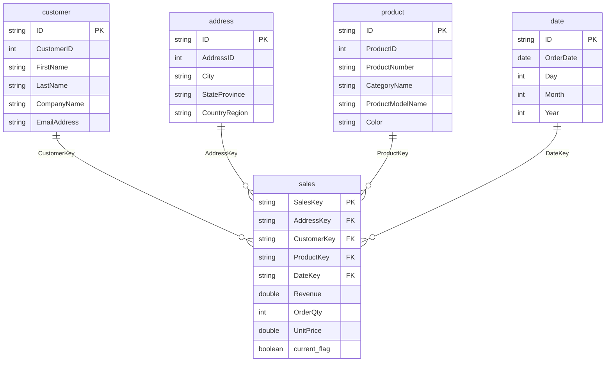

# 📊 Análise do Modelo Semântico — Workshop_DMF-DEV

> Análise do modelo semântico Power BI: tabelas, colunas, relacionamentos e configurações.

---

## 📋 Sumário

1. [Modelo: Sales](#modelo-sales)
2. [Tabelas e Colunas](#tabelas-e-colunas)
3. [Relacionamentos](#relacionamentos)
4. [Fonte de Dados (DirectLake)](#fonte-de-dados-directlake)
5. [Diagrama do Star Schema](#diagrama-do-star-schema)
6. [Medidas e Métricas](#medidas-e-métricas)
7. [Configurações do Modelo](#configurações-do-modelo)

---

## Modelo: Sales

| Atributo | Detalhe |
|---|---|
| **ID** | `66830f47-dfad-480f-a054-34d0d9bfd761` |
| **Modo de Conexão** | **DirectLake** (acesso direto ao OneLake sem importação) |
| **Fonte** | Gold lakehouse — `adventureworks` schema |
| **Número de tabelas** | 5 (4 dimensões + 1 fato) |
| **Nível de Compatibilidade** | 1604 |
| **Cultura** | `en-US` |
| **Relatório associado** | Sales Report |

---

## 📋 Tabelas e Colunas

### Tabela: `sales` (Fato)

Fonte: `gold.adventureworks.fact_sales`

| Coluna | Tipo | Oculta | Resumo | Notas |
|---|---|---|---|---|
| `SalesKey` | string | Não | none | Chave natural: concat(SalesOrderID + SalesOrderDetailID) |
| `AddressKey` | string | Não | none | FK → dimension_address.ID |
| `CustomerKey` | string | **Sim** | none | FK → dimension_customer.ID |
| `ProductKey` | string | **Sim** | none | FK → dimension_product.ID |
| `DateKey` | string | **Sim** | none | FK → dimension_date.ID |
| `Revenue` | double | Não | **sum** | Receita = OrderQty × UnitPrice |
| `OrderQty` | int64 | Não | **sum** | Quantidade pedida |
| `UnitPrice` | double | Não | sum | Preço unitário |
| `current_flag` | boolean | Não | none | Flag SCD (true = versão ativa) |
| `current_date` | dateTime | **Sim** | none | Data de início de validade |
| `end_date` | dateTime | **Sim** | none | Data de fim de validade |

> 🔑 **Métricas nativas**: `Revenue` (sum), `OrderQty` (sum) — sem medidas DAX customizadas.

---

### Tabela: `customer` (Dimensão)

Fonte: `gold.adventureworks.dimension_customer`

| Coluna | Tipo | Oculta | Notas |
|---|---|---|---|
| `ID` | string | **Sim** | Surrogate key SHA-256 |
| `CustomerID` | int64 | **Sim** | Chave de negócio |
| `Title` | string | Não | Título (Mr., Ms., etc.) |
| `FirstName` | string | Não | |
| `MiddleName` | string | Não | |
| `LastName` | string | Não | |
| `CompanyName` | string | Não | |
| `EmailAddress` | string | Não | |
| `Phone` | string | Não | |
| `current_flag` | boolean | Não | SCD flag |
| `current_date` | dateTime | **Sim** | |
| `end_date` | dateTime | **Sim** | |

---

### Tabela: `address` (Dimensão)

Fonte: `gold.adventureworks.dimension_address`

| Coluna | Tipo | Oculta | Notas |
|---|---|---|---|
| `ID` | string | **Sim** | Surrogate key SHA-256 |
| `AddressID` | int64 | Não | Chave de negócio |
| `AddressLine1` | string | **Sim** | Endereço ocultado no modelo |
| `AddressLine2` | string | Não | |
| `City` | string | Não | |
| `StateProvince` | string | Não | |
| `CountryRegion` | string | Não | |
| `current_flag` | boolean | Não | SCD flag |
| `current_date` | dateTime | **Sim** | |
| `end_date` | dateTime | **Sim** | |

> 📍 Nota: `AddressLine1` está oculto no modelo, mas `City`, `StateProvince` e `CountryRegion` estão visíveis para análise geográfica.

---

### Tabela: `product` (Dimensão)

Fonte: `gold.adventureworks.dimension_product`

| Coluna | Tipo | Oculta | Notas |
|---|---|---|---|
| `ID` | string | **Sim** | Surrogate key SHA-256 |
| `ProductID` | int64 | **Sim** | Chave de negócio |
| `ProductNumber` | string | Não | Código do produto |
| `Color` | string | Não | Cor do produto |
| `Size` | string | Não | Tamanho |
| `Weight` | string | Não | Peso |
| `CategoryName` | string | Não | Nome da categoria (join silver) |
| `ProductModelName` | string | Não | Nome do modelo (join silver) |
| `current_flag` | boolean | Não | SCD flag |
| `current_date` | dateTime | **Sim** | |
| `end_date` | dateTime | **Sim** | |

---

### Tabela: `date` (Dimensão)

Fonte: `gold.adventureworks.dimension_date`

| Coluna | Tipo | Oculta | Notas |
|---|---|---|---|
| `ID` | string | **Sim** | Surrogate key SHA-256 |
| `OrderDate` | dateTime | Não | Data do pedido |
| `Day` | int64 | Não | Dia do mês |
| `Month` | int64 | Não | Mês |
| `Year` | int64 | Não | Ano |

> 📅 Dimensão de data simples — apenas datas com pedidos (não é um calendário completo).

---

## 🔗 Relacionamentos

| ID do Relacionamento | De | Para | Tipo | Nota |
|---|---|---|---|---|
| `3dcb6b02...` | `address.ID` | `sales.AddressKey` | Muitos-para-um | |
| `6f488d1e...` | `customer.ID` | `sales.CustomerKey` | Muitos-para-um | |
| `eacf8458...` | `sales.DateKey` | `date.ID` | Muitos-para-um | Direção invertida: fato → dimensão |
| `70d3d794...` | `product.ID` | `sales.ProductKey` | Muitos-para-um | Com `relyOnReferentialIntegrity` habilitado |

### Diagrama de Relacionamentos (TMDL)

```
address.ID ──────────────────────► sales.AddressKey
customer.ID ─────────────────────► sales.CustomerKey
sales.DateKey ───────────────────► date.ID
product.ID ──────────────────────► sales.ProductKey
```

---

## ⚡ Fonte de Dados (DirectLake)

```
expression 'DirectLake - gold' =
    let
        Source = AzureStorage.DataLake(
            "https://onelake.dfs.fabric.microsoft.com/
             89ed2ee4-2011-47c8-a88a-eaa6b2308f33/
             289c0390-715e-40e1-bc15-fe27c9ad31f6",
            [HierarchicalNavigation=true]
        )
    in
        Source
```

| Parâmetro | Valor |
|---|---|
| **Modo** | DirectLake (acesso direto ao OneLake) |
| **Workspace ID** | `89ed2ee4-2011-47c8-a88a-eaa6b2308f33` |
| **Item ID (gold)** | `289c0390-715e-40e1-bc15-fe27c9ad31f6` |
| **Schema usado** | `adventureworks` |
| **Tabelas consumidas** | `dimension_customer`, `dimension_address`, `dimension_product`, `dimension_date`, `fact_sales` |

---

## 📐 Diagrama do Star Schema



---

## 📐 Medidas e Métricas

> O modelo **não possui medidas DAX customizadas** — utiliza apenas as agregações nativas definidas por coluna.

| Coluna | Tabela | Agregação Padrão |
|---|---|---|
| `Revenue` | sales | SUM |
| `OrderQty` | sales | SUM |
| `UnitPrice` | sales | SUM |
| `AddressID` | address | COUNT |

### Funcionalidades Configuradas
- **Time Intelligence habilitada**: `__PBI_TimeIntelligenceEnabled = 1`
- **DirectLake on OneLake**: configurado via Web (sem gateway)
- **ProTooling**: `DirectLakeOnOneLakeInWeb, WebModelingEdit, TMDL-Extension`

---

## ⚙️ Configurações do Modelo

| Configuração | Valor |
|---|---|
| `compatibilityLevel` | `1604` |
| `culture` | `en-US` |
| `sourceQueryCulture` | `en-US` |
| `defaultPowerBIDataSourceVersion` | `powerBI_V3` |
| `legacyRedirects` | habilitado |
| `returnErrorValuesAsNull` | habilitado |
| `PBI_IncludeFutureArtifacts` | `false` |
