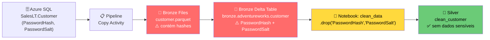
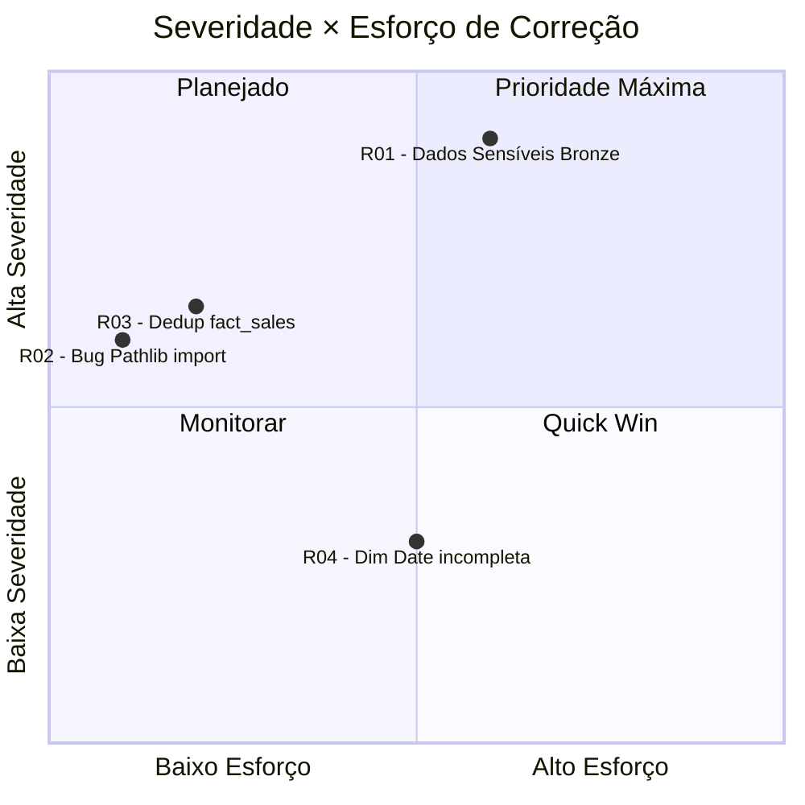

# ⚠️ Relatório de Riscos — Workshop_DMF-DEV

> **Documento**: Identificação e análise de riscos técnicos e de segurança encontrados no workspace.  
> **Gerado em**: 2026-07-10  
> **Workspace**: Workshop_DMF-DEV  
> **Analista**: GitHub Copilot (análise automatizada)

---

## 📋 Sumário

| # | Risco | Severidade | Categoria |
|---|---|---|---|
| R01 | Dados sensíveis (`PasswordHash`/`PasswordSalt`) expostos no Bronze | 🔴 **Alto** | Segurança |
| R02 | Bug de importação em `clean_data` (`from Pathlib import Path`) | 🟡 **Médio** | Qualidade de Código |
| R03 | Deduplicação incorreta em `fact_sales` | 🟡 **Médio** | Qualidade de Dados |
| R04 | Dimensão de data incompleta (somente datas com pedidos) | 🟠 **Baixo-Médio** | Modelagem |

---

## 🔴 R01 — Dados Sensíveis Expostos no Bronze Lakehouse

### Descrição

A tabela `bronze.adventureworks.customer` contém as colunas **`PasswordHash`** e **`PasswordSalt`** copiadas diretamente do Azure SQL Database (AdventureWorks SalesLT). Essas colunas representam credenciais de acesso dos clientes em formato hash e nunca deveriam persistir em uma camada de dados analíticos sem controle rigoroso de acesso.

### Onde ocorre

| Camada | Artefato | Coluna Sensível | Status |
|---|---|---|---|
| **Bronze** | `bronze.adventureworks.customer` | `PasswordHash` | ⚠️ **Presente** |
| **Bronze** | `bronze.adventureworks.customer` | `PasswordSalt` | ⚠️ **Presente** |
| **Silver** | `silver.adventureworks.clean_customer` | `PasswordHash` | ✅ Removida |
| **Silver** | `silver.adventureworks.clean_customer` | `PasswordSalt` | ✅ Removida |
| **Gold** | `gold.adventureworks.dimension_customer` | `PasswordHash` | ✅ Não existe |
| **Gold** | `gold.adventureworks.dimension_customer` | `PasswordSalt` | ✅ Não existe |

### Fluxo do dado sensível



### Código no notebook `clean_data` que trata o problema

```python
# Célula: Limpeza da tabela customer
df_customer = spark.read.table("bronze.adventureworks.customer")

df_customer = df_customer.drop(
    "PasswordHash",    # ← removida aqui
    "PasswordSalt",    # ← removida aqui
    "rowguid",
    "ModifiedDate"
)

df_customer.write.mode("overwrite").saveAsTable("silver.adventureworks.clean_customer")
```

> ✅ A remoção acontece corretamente no `clean_data` — **o risco está na camada Bronze**, que persiste os dados antes da limpeza.

### Impacto

- Qualquer usuário com acesso de **leitura ao Bronze Lakehouse** pode acessar os hashes de senha dos clientes.
- Os arquivos Parquet em `bronze/Files/saleslt/` também contêm as colunas sensíveis.
- Em caso de auditoria de privacidade (LGPD/GDPR), a presença dessas colunas no Bronze configura **armazenamento desnecessário de dados pessoais sensíveis**.

### Recomendações

1. **Imediato**: Restringir acesso ao Bronze Lakehouse — apenas a conta de serviço do pipeline deve ter permissão de leitura.
2. **Curto prazo**: Remover as colunas `PasswordHash` e `PasswordSalt` **na origem** (na atividade Copy do pipeline, usar mapeamento de colunas para excluí-las antes de gravar no Bronze).
3. **Configuração no Pipeline** — adicionar mapeamento de exclusão na Copy Activity:
   ```json
   // No mapping da Copy Activity, remover as colunas:
   "PasswordHash": { "skip": true },
   "PasswordSalt": { "skip": true }
   ```
4. **Auditoria**: Verificar se os arquivos Parquet em `bronze/Files/` já foram replicados ou compartilhados externamente.
5. **Monitoramento**: Adicionar política de Data Loss Prevention (DLP) no workspace para detectar acesso indevido a essas colunas.

---

## 🟡 R02 — Bug de Importação em `clean_data`

### Descrição

O notebook `clean_data` contém uma importação com **capitalização incorreta** do módulo `pathlib`:

```python
# ❌ INCORRETO — 'Pathlib' com P maiúsculo não existe no Python padrão
from Pathlib import Path

# ✅ CORRETO
from pathlib import Path
```

### Onde ocorre

| Artefato | ID | Célula |
|---|---|---|
| Notebook `clean_data` | `b8df2fa9-4923-4b27-a018-ef5db55611c1` | Célula de imports (início do notebook) |

### Impacto

- Em ambientes Linux (Spark on Fabric), Python é **case-sensitive**: `from Pathlib import Path` lança `ModuleNotFoundError` e **interrompe a execução inteira do notebook**.
- O pipeline parará na etapa `DataCleasing` com erro, impedindo o processamento do Silver e consequentemente do Gold.
- As 10 tabelas `clean_*` do Silver não serão atualizadas.

### Recomendação

Corrigir a importação:

```python
# Substituir:
from Pathlib import Path
# Por:
from pathlib import Path
```

---

## 🟡 R03 — Deduplicação Incorreta em `fact_sales`

### Descrição

O notebook `fact_sales` realiza deduplicação da tabela `salesorderdetail` usando `SalesOrderID` como chave, quando o correto seria `SalesOrderDetailID`.

### Onde ocorre

| Artefato | ID | Célula |
|---|---|---|
| Notebook `fact_sales` | `f6e97967-a7b5-497a-9cbf-717c5d4648d4` | Célula 1 (Prepara dados de vendas) |

### Código problemático

```python
# ❌ INCORRETO — deduplica pelo ID do pedido, perdendo linhas de detalhe
df_detail = spark.read.table("silver.adventureworks.hist_salesorderdetail") \
    .filter(col("current") == True) \
    .dropDuplicates(["SalesOrderID"])  # ← um pedido pode ter múltiplos itens!

# ✅ CORRETO — deduplica pelo ID do item de detalhe
df_detail = spark.read.table("silver.adventureworks.hist_salesorderdetail") \
    .filter(col("current") == True) \
    .dropDuplicates(["SalesOrderDetailID"])
```

### Impacto

| Cenário | Resultado atual | Resultado esperado |
|---|---|---|
| Pedido com 3 produtos diferentes | Apenas **1 linha** na `fact_sales` | **3 linhas** na `fact_sales` |
| Receita total calculada | **Subestimada** | Correta |
| Análises por produto | Incompletas | Completas |

> ⚠️ Este bug causa **perda silenciosa de dados** na tabela fato. As métricas de receita e quantidade no modelo semântico estarão incorretas.

### Recomendação

Substituir `dropDuplicates(["SalesOrderID"])` por `dropDuplicates(["SalesOrderDetailID"])` na **Célula 1** do notebook `fact_sales`.

---

## 🟠 R04 — Dimensão de Data Incompleta

### Descrição

O notebook `dimension_date` deriva as datas a partir das datas de pedidos existentes em `hist_salesorderheader`, em vez de usar um gerador de calendário completo.

### Onde ocorre

| Artefato | ID |
|---|---|
| Notebook `dimension_date` | `bf5bb233-d2b5-4012-9df7-483b3ff70694` |

### Código atual

```python
# Lê apenas datas que têm pedidos
df_dates = spark.read.table("silver.adventureworks.hist_salesorderheader") \
    .filter(col("current") == True) \
    .dropDuplicates(["OrderDate"]) \
    .select("OrderDate") \
    .withColumn("Day", dayofmonth("OrderDate")) \
    .withColumn("Month", month("OrderDate")) \
    .withColumn("Year", year("OrderDate"))
```

### Impacto

| Análise | Impacto |
|---|---|
| Comparação de dias sem vendas | ❌ Dias sem pedidos não existem na dimensão |
| Análise de gaps (períodos sem vendas) | ❌ Não é possível |
| Filtros por mês/ano completo no Power BI | ⚠️ Meses com poucos pedidos terão poucos dias disponíveis |
| Relatórios de sazonalidade | ⚠️ Distorção em períodos com baixo volume |

### Recomendação

Substituir pela geração de um calendário completo com intervalo fixo:

```python
from pyspark.sql.functions import sequence, explode, to_date, lit

# Gerar datas de 2010-01-01 até 2030-12-31
df_dates = spark.sql("""
    SELECT explode(sequence(
        to_date('2010-01-01'),
        to_date('2030-12-31'),
        interval 1 day
    )) AS OrderDate
""") \
.withColumn("Day", dayofmonth("OrderDate")) \
.withColumn("Month", month("OrderDate")) \
.withColumn("Year", year("OrderDate"))
```

---

## 📊 Resumo de Riscos



| Risco | Severidade | Esforço de Correção | Prioridade |
|---|---|---|---|
| R01 — Dados Sensíveis | 🔴 Alto | Médio (pipeline mapping + RBAC) | **1ª** |
| R02 — Bug Pathlib | 🟡 Médio | Baixo (1 linha de código) | **2ª** |
| R03 — Dedup fact_sales | 🟡 Médio | Baixo (1 linha de código) | **2ª** |
| R04 — Dim Date | 🟠 Baixo-Médio | Médio (refatorar notebook) | **3ª** |

---

## ✅ Plano de Ação Sugerido

```
Sprint 1 (Imediato)
├── [ ] R02: Corrigir `from Pathlib import Path` → `from pathlib import Path` em clean_data
├── [ ] R03: Corrigir `dropDuplicates(["SalesOrderID"])` → `dropDuplicates(["SalesOrderDetailID"])` em fact_sales
└── [ ] R01: Restringir RBAC no Bronze Lakehouse (apenas service principal do pipeline)

Sprint 2 (Curto Prazo)
├── [ ] R01: Adicionar exclusão de PasswordHash/PasswordSalt no mapeamento da Copy Activity
├── [ ] R01: Reprocessar bronze para remover registros com as colunas sensíveis
└── [ ] R04: Refatorar dimension_date para usar gerador de calendário completo

Sprint 3 (Médio Prazo)
└── [ ] R01: Implementar política DLP no workspace para monitoramento contínuo
```

---

*Gerado por análise automatizada via GitHub Copilot + Microsoft Fabric Skills*
